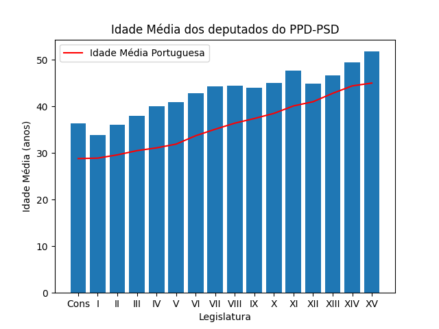
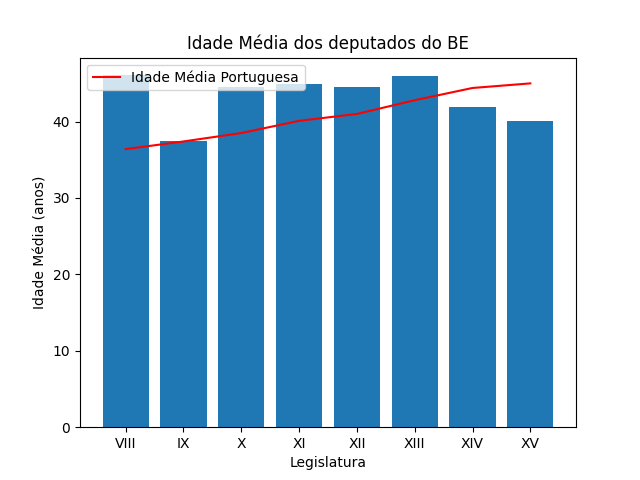

# portuguese_ar_member_data
 Scraping processing and visualization of data of members of the Assembly of the Republic of Portugal

Source:
Parlamentary data: https://www.parlamento.pt/DeputadoGP/Paginas/Deputados.aspx?more=1
Median age: https://population.un.org/wpp/
AR members salary: https://www.parlamento.pt/DeputadoGP/Paginas/EstatutoRemuneratorioDeputados_anexo.aspx
Minimum Wage in Portugal: https://www.pordata.pt/Portugal/Sal%C3%A1rio+m%C3%ADnimo+nacional-74